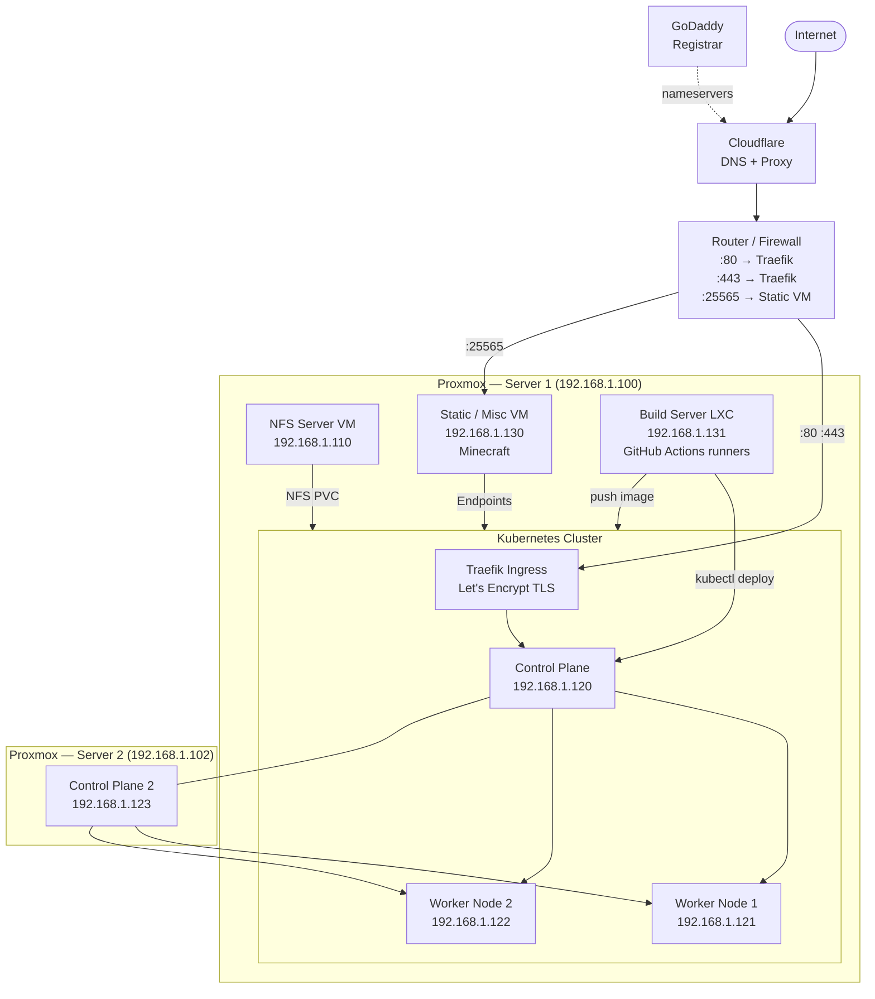

# R16a infrastructure

> Last updated: 2026-07-20  
> Status: Living document — update as infrastructure changes

Personal homelab running on two physical servers with Proxmox as the hypervisor. All services run as VMs or LXC containers. A Kubernetes cluster handles all HTTP/S workloads behind Traefik ingress. Static VM workloads integrate into the cluster via k8s Endpoint services so everything is routed through Traefik — Minecraft is the only true exception.

---

## Contributors

| Role                   | Contributor        |
| ---------------------- | ------------------ |
| Software Engineer      | Ramphy Aquino Nova |
| DevOps Engineer        | Ramphy Aquino Nova |
| Cloud Engineer         | Ramphy Aquino Nova |
| Network Engineer       | Ramphy Aquino Nova |
| Systems Engineer       | Ramphy Aquino Nova |
| Security Engineer      | Ramphy Aquino Nova |
| Database Administrator | Ramphy Aquino Nova |

---

## Documentation

| File                             | Contents                                         |
| -------------------------------- | ------------------------------------------------ |
| [network.md](./network.md)       | DNS, domains, port forwarding, LAN IPs           |
| [servers.md](./servers.md)       | Physical servers, Proxmox VMs and LXC containers |
| [kubernetes.md](./kubernetes.md) | Cluster info, namespaces, Traefik, storage       |
| [services.md](./services.md)     | All deployed applications and services           |
| [storage.md](./storage.md)       | NFS server, PVCs, backup strategy                |
| [cicd.md](./cicd.md)             | Build server, GitHub Actions, registry, pipeline |

---

## High-level topology



---

## Routing pattern

All HTTP/S traffic — including apps running on the Static VM — is routed through Traefik. Static VM workloads run as Docker containers and are wired into the cluster via manual k8s Endpoint objects pointing to `192.168.1.130`. This avoids per-app port forwarding on the router.

```
Browser → Cloudflare → Router :443 → Traefik → k8s Service (Endpoints) → Static VM Docker container
```

Minecraft is the only workload that bypasses this pattern (raw TCP, router forwards :25565 directly). Proper k8s implementation coming soon...
