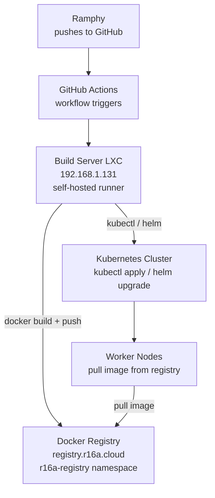

# CI/CD pipeline

> See also: [servers.md](./servers.md) | [services.md](./services.md) | [kubernetes.md](./kubernetes.md)

---

## Overview

All builds and deployments are driven by GitHub Actions using self-hosted runners on the Build Server LXC. Ramphy pushes code to GitHub, the runner builds and pushes the image to the private registry, and deploys to the cluster directly via `kubectl` or Helm.

---

## Pipeline flow

---

## Build Server LXC

| Property  | Value                                              |
|-----------|----------------------------------------------------|
| IP        | `192.168.1.131`                                    |
| Type      | Proxmox LXC container                              |
| Runtime   | GitHub Actions self-hosted runners                 |
| Pushes to | `registry.r16a.cloud`                              |
| Deploys to| k8s cluster via `kubectl` / Helm                   |

---

## Private Docker Registry

| Property  | Value                            |
|-----------|----------------------------------|
| URL       | `https://registry.r16a.cloud`    |
| Namespace | `r16a-registry`                  |
| Software  | Docker Registry v2               |
| Storage   | NFS PVC (`192.168.1.110`)        |

All images used in the cluster are sourced from this registry. The Build Server pushes here after every successful build. Worker nodes pull from here on pod start and rollout.
