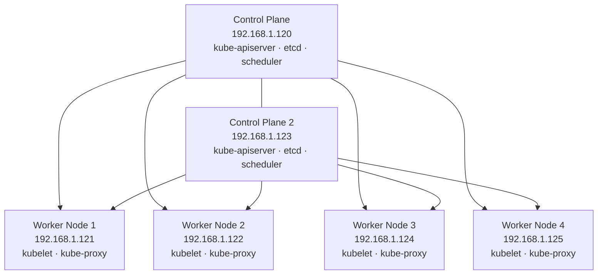
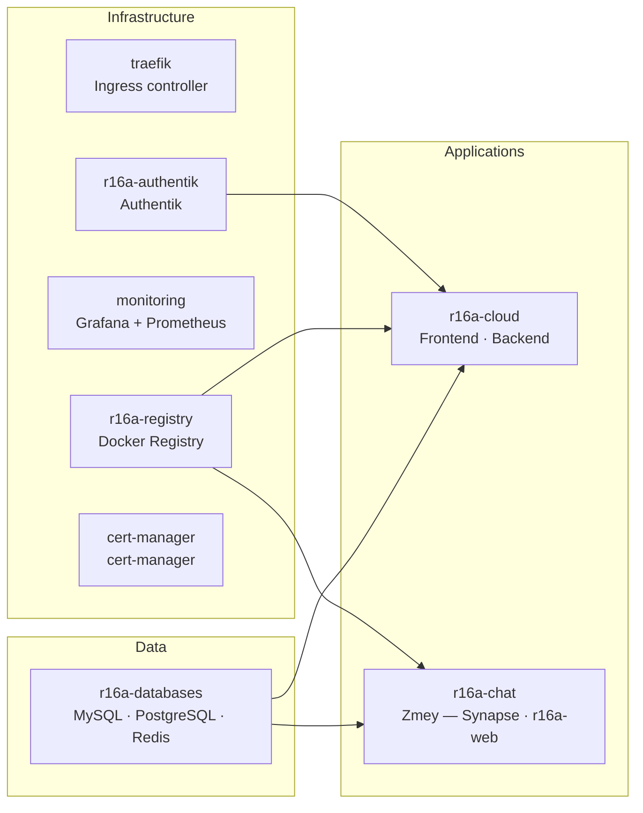
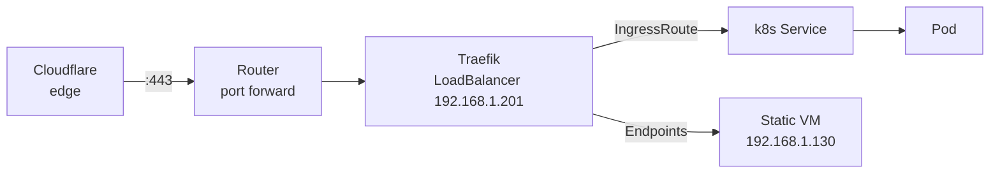

# Kubernetes cluster

> See also: [servers.md](./servers.md) | [services.md](./services.md) | [storage.md](./storage.md) | [network.md](./network.md)

---

## Cluster info

| Property           | Value                                    |
|--------------------|------------------------------------------|
| Distribution       | kubeadm             |
| Version            | TBD                                      |
| Nodes              | 2 control plane (HA) + 4 workers         |
| CNI                | Calico        |
| Ingress            | Traefik (IngressRoute CRDs)              |
| TLS                | Let's Encrypt via Traefik ACME — active  |
| Load balancer      | MetalLB (L2 mode) — pool `192.168.1.200-220` |
| Persistent storage | NFS VM (`192.168.1.110`) via PVCs        |

---

## Node layout



---

## Namespace layout



### Namespace reference

| Namespace        | Contents                                              | Notes                                      |
|------------------|-------------------------------------------------------|--------------------------------------------|
| `r16a-cloud`     | r16a-cloud frontend (Angular), backend (Spring Boot)  |                                            |
| `r16a-chat`      | Zmey — Synapse (Matrix), r16a-web                     | Internal name is Zmey; still in development |
| `r16a-databases` | MySQL, PostgreSQL, Redis                              | Shared data layer for all apps             |
| `r16a-registry`  | Docker Registry v2                                    | Private image registry, NFS-backed         |
| `cert-manager`   | cert-manager                                          | TLS certificate management for Traefik     |
| `r16a-authentik` | Authentik                                             |                                            |
| `traefik`        | Traefik                                               |                                            |
| `monitoring`     | Grafana + Prometheus                                  |                                            |


---

## Ingress — Traefik

| Property       | Value                                              |
|----------------|----------------------------------------------------|
| Controller     | Traefik                                            |
| Config style   | CRD (IngressRoute)                                 |
| TLS            | Let's Encrypt ACME — real certs, active            |
| Challenge type | HTTP-01 |
| Entry points   | `:80` (redirect to HTTPS), `:443` (TLS)            |
| Exposed via    | LoadBalancer — MetalLB IP `192.168.1.201`          |

### Traffic flow




---

## Static VM integration

Apps running on the Static VM (`192.168.1.130`) as Docker containers are exposed through Traefik using manual k8s Endpoint objects. No additional port forwarding on the router is needed.

```yaml
# Example pattern — headless Service + manual Endpoints
apiVersion: v1
kind: Service
metadata:
spec:
  ports:
    - port: 80
      targetPort: <container-port>
---
apiVersion: v1
kind: Endpoints
metadata:
subsets:
  - addresses:
      - ip: 192.168.1.130
    ports:
      - port: <container-port>
```

---

## Persistent storage

All PVCs in the cluster are backed by the NFS VM at `192.168.1.110`. See [storage.md](./storage.md) for full details.

| Workload           | Namespace        | Storage backend |
|--------------------|------------------|-----------------|
| MySQL              | `r16a-databases` | NFS PVC         |
| PostgreSQL         | `r16a-databases` | NFS PVC         |
| Redis              | `r16a-databases` | NFS PVC         |
| Docker Registry    | `r16a-registry`  | NFS PVC         |
| r16a-cloud files   | `r16a-cloud`     | NFS PVC         |
