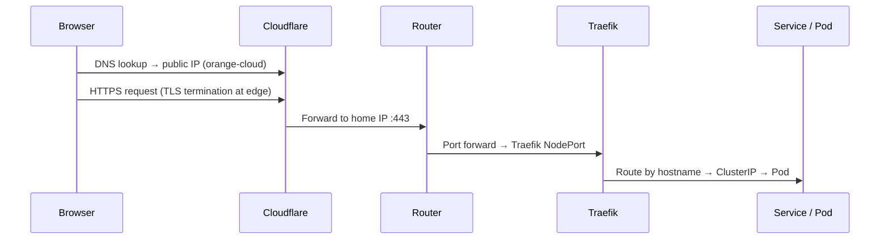

# Network

> See also: [servers.md](./servers.md) | [kubernetes.md](./kubernetes.md)

---

## DNS & domains

| Service    | Role                                | Notes                                    |
|------------|-------------------------------------|------------------------------------------|
| GoDaddy    | Domain registrar                    | Domains purchased here                   |
| Cloudflare | DNS provider + reverse proxy        | Nameservers delegated from GoDaddy to CF |

### DNS flow



---

## Public subdomains

| Subdomain               | Service              | Auth                        | Notes                                |
|-------------------------|----------------------|-----------------------------|--------------------------------------|
| `cloud.r16a.cloud`      | r16a-cloud           | Native + Authentik (web)    | -  |
| `grafana.r16a.cloud`    | Grafana              | Username/password + Authentik SSO | Cluster monitoring             |
| `auth.r16a.cloud`       | Authentik            | Self                        | -                |
| `registry.r16a.cloud`   | Docker Registry      | htpasswd (basic auth)       | Private image registry               |

---

## Port forwarding rules

| External port | Protocol | Internal destination              | Purpose                          |
|---------------|----------|-----------------------------------|----------------------------------|
| 80            | TCP      | Traefik NodePort (worker nodes)   | HTTP — redirects to HTTPS        |
| 443           | TCP      | Traefik NodePort (worker nodes)   | HTTPS ingress for all k8s apps   |
| 25565         | TCP      | Static VM `192.168.1.130`         | Minecraft Java Edition           |

---

## LAN IP assignments

| Host / VM              | IP                | Type         | Notes                              |
|------------------------|-------------------|--------------|------------------------------------|
| Router                 | `192.168.1.1`     | Network      |                                    |
| Proxmox host           | `192.168.1.100`   | Physical     |                                    |
| Proxmox host 2         | `192.168.1.102`   | Physical     | Hosts k8s control plane 2          |
| NFS VM                 | `192.168.1.110`   | VM           | Persistent storage for everything  |
| Static / Misc VM       | `192.168.1.130`   | VM           | Minecraft + Docker workloads       |
| Build Server           | `192.168.1.131`   | LXC container| GitHub Actions runners             |
| k8s control plane      | `192.168.1.120`   | VM           |                                    |
| k8s control plane 2    | `192.168.1.123`   | VM           | On Proxmox host 2, HA              |
| k8s worker node 1      | `192.168.1.121`   | VM           |                                    |
| k8s worker node 2      | `192.168.1.122`   | VM           |                                    |
| k8s worker node 3      | `192.168.1.124`   | VM           | On Proxmox host 2                  |
| k8s worker node 4      | `192.168.1.125`   | VM           | On Proxmox host 2                  |
| Docker Registry        | —                 | k8s workload | Runs in cluster, exposed via Traefik |

---

## Static VM routing pattern

Apps on the Static VM are not port-forwarded individually. Instead they run as Docker containers and are wired into the k8s cluster via manual Endpoint objects. Traefik routes inbound traffic to them like any other service.

```
Router :443 → Traefik → k8s Service → Endpoints (192.168.1.130:<port>) → Docker container
```

This means the router config stays clean — only ports 80, 443, and 25565 are ever forwarded.
