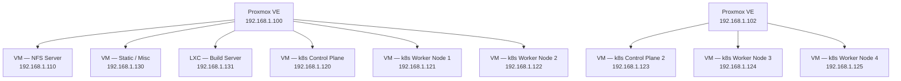

# Servers

> See also: [network.md](./network.md) | [kubernetes.md](./kubernetes.md) | [storage.md](./storage.md)

---

## Physical servers

### Server 1 (active)

| Property   | Value                                         |
| ---------- | --------------------------------------------- |
| IP         | `192.168.1.100`                               |
| Hypervisor | Proxmox VE                                    |
| Role       | All VMs, LXC containers, k8s cluster, storage |
| Status     | Production                                    |

### Server 2 (active)

| Property   | Value                                                     |
| ---------- | --------------------------------------------------------- |
| IP         | `192.168.1.102`                                           |
| Hypervisor | Proxmox VE                                                |
| Role       | k8s control plane HA node                                 |
| Status     | Production                                                |
| Notes      | Joined Proxmox cluster; hosts second k8s control plane VM |

---

## Proxmox inventory

---

## VM / LXC details

### NFS Server VM

| Property  | Value                                                                                                   |
| --------- | ------------------------------------------------------------------------------------------------------- |
| IP        | `192.168.1.110`                                                                                         |
| Type      | VM                                                                                                      |
| Purpose   | Centralised persistent storage for all VMs and k8s workloads                                            |
| Protocol  | NFS                                                                                                     |
| Consumers | k8s PVCs (all stateful workloads), direct app mounts                                                    |
| Notes     | Single point of failure for all stateful data. Highest backup priority. See [storage.md](./storage.md). |

---

### Static / Misc VM

| Property    | Value                                                                                                 |
| ----------- | ----------------------------------------------------------------------------------------------------- |
| IP          | `192.168.1.130`                                                                                       |
| Type        | VM                                                                                                    |
| Purpose     | Hosts Docker containers for non-k8s workloads + Minecraft                                             |
| Runtime     | Docker                                                                                                |
| Integration | Apps wired into k8s via manual Endpoint objects                                                       |
| Open port   | `:25565` TCP — forwarded directly from router (Minecraft only)                                        |
| Notes       | This is supposed to be an easy way to deploy simple things that don't require a full k8s architecture |

#### Deployed workloads

| App       | Stack                  | Domain | k8s Endpoint              |
| --------- | ---------------------- | ------ | ------------------------- |
| Minecraft | Minecraft Java Edition | —      | No (raw TCP port forward) |

---

### Build Server LXC

| Property   | Value                                          |
| ---------- | ---------------------------------------------- |
| IP         | `192.168.1.131`                                |
| Type       | LXC container                                  |
| Purpose    | CI/CD — build Docker images and deploy to k8s  |
| Runtime    | GitHub Actions self-hosted runners             |
| Deploys to | Kubernetes cluster via `kubectl` / Helm        |
| Pushes to  | `registry.r16a.cloud` (Docker Registry in k8s) |

---

### k8s Control Plane VM

| Property   | Value                                                                        |
| ---------- | ---------------------------------------------------------------------------- |
| IP         | `192.168.1.120`                                                              |
| Type       | VM                                                                           |
| Purpose    | Kubernetes control plane                                                     |
| Components | kube-apiserver, etcd, kube-scheduler, kube-controller-manager                |
| Notes      | Single control plane — no HA yet... maybe one day if AI stops eating RAM lol |

---

### k8s Control Plane 2 VM

| Property   | Value                                                               |
| ---------- | ------------------------------------------------------------------- |
| IP         | `192.168.1.123`                                                     |
| Type       | VM                                                                  |
| Host       | Server 2 (`192.168.1.102`)                                          |
| Purpose    | Kubernetes control plane (HA)                                       |
| Components | kube-apiserver, etcd, kube-scheduler, kube-controller-manager       |
| Notes      | Second control plane node — joined for HA alongside `192.168.1.120` |

---

### k8s Worker Node 1 VM

| Property   | Value                                  |
| ---------- | -------------------------------------- |
| IP         | `192.168.1.121`                        |
| Type       | VM                                     |
| Purpose    | Kubernetes worker                      |
| Components | kubelet, kube-proxy, container runtime |

---

### k8s Worker Node 2 VM

| Property   | Value                                  |
| ---------- | -------------------------------------- |
| IP         | `192.168.1.122`                        |
| Type       | VM                                     |
| Purpose    | Kubernetes worker                      |
| Components | kubelet, kube-proxy, container runtime |

---

### k8s Worker Node 3 VM

| Property   | Value                      |
| ---------- | -------------------------- |
| IP         | `192.168.1.124`            |
| Type       | VM                         |
| Host       | Server 2 (`192.168.1.102`) |
| Purpose    | Kubernetes worker          |
| Components | IDK                        |

---

### k8s Worker Node 4 VM

| Property   | Value                      |
| ---------- | -------------------------- |
| IP         | `192.168.1.125`            |
| Type       | VM                         |
| Host       | Server 2 (`192.168.1.102`) |
| Purpose    | Kubernetes worker          |
| Components | IDk                        |
