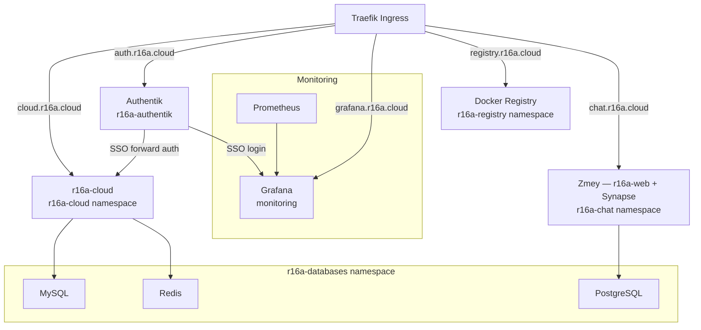

# Services

> See also: [kubernetes.md](./kubernetes.md) | [storage.md](./storage.md) | [cicd.md](./cicd.md)

All services are exposed via Traefik ingress at `*.r16a.cloud` with Let's Encrypt TLS.

---

## Service map

---

## Authentik — Identity provider

| Property        | Value                                          |
| --------------- | ---------------------------------------------- |
| URL             | `https://auth.r16a.cloud`                      |
| Namespace       | `r16a-authentik`                               |
| Purpose         | SSO / identity provider, easy authentication   |
| Integrated with | r16a-cloud (forward auth), Grafana (SSO login) |

---

## r16a-cloud — Cloud storage

| Property    | Value                                                             |
| ----------- | ----------------------------------------------------------------- |
| URL         | `https://cloud.r16a.cloud`                                        |
| Namespace   | `r16a-cloud`                                                      |
| Description | Simple cloud storage like iCloud or google frive but with privacy |
| Auth        | Native auth + Authentik SSO (web), native only (mobile)           |

### Stack

| Layer    | Technology         | Location                   |
| -------- | ------------------ | -------------------------- |
| Frontend | Angular            | `r16a-cloud` namespace     |
| Backend  | Java + Spring Boot | `r16a-cloud` namespace     |
| Database | MySQL              | `r16a-databases` namespace |
| Cache    | Redis              | `r16a-databases` namespace |
| Files    | NFS PVC            | NFS VM `192.168.1.110`     |

---

## Zmey (r16a-chat) — Messaging app

| Property    | Value                                                                                |
| ----------- | ------------------------------------------------------------------------------------ |
| Namespace   | `r16a-chat`                                                                          |
| Description | Internal name for Zmey, a messaging app — still in development                       |
| Status      | In development                                                                       |
| Domains     | `chat.r16a.cloud` (internal), `zmey.chat` (official website), `zmey.ch` (redundancy) |

### Stack

| Layer               | Technology                      | Location              |
| ------------------- | ------------------------------- | --------------------- |
| Homeserver          | Synapse (Matrix implementation) | `r16a-chat` namespace |
| Web client branding | Angular                         | `r16a-chat` namespace |
| Client              | Flutter                         | `r16a-chat` namespace |

---

## Grafana + Prometheus — Cluster monitoring

| Property    | Value                                                          |
| ----------- | -------------------------------------------------------------- |
| Grafana URL | `https://grafana.r16a.cloud`                                   |
| Namespace   | `monitoring`                                                   |
| Purpose     | Kubernetes infrastructure observability                        |
| Scope       | k8s nodes and pods only — app-level metrics not yet configured |
| Auth        | Username + password, or Authentik SSO                          |

---

## Docker Registry — Private image registry

| Property  | Value                                                                                                             |
| --------- | ----------------------------------------------------------------------------------------------------------------- |
| URL       | `https://registry.r16a.cloud`                                                                                     |
| Namespace | `r16a-registry`                                                                                                   |
| Software  | Docker Registry v2                                                                                                |
| Purpose   | Private registry for all images running in the cluster                                                            |
| Storage   | NFS PVC (`192.168.1.110`)                                                                                         |
| Used by   | Build Server LXC (push), k8s worker nodes (pull)                                                                  |
| Auth      | htpasswd (basic auth)                                                                                             |
| Notes     | All cluster workloads pull from here. If the registry is unavailable, pod restarts and new deployments will fail. |

---

## Shared databases — r16a-databases namespace

| Engine     | Namespace        | Storage | Used by                       |
| ---------- | ---------------- | ------- | ----------------------------- |
| MySQL      | `r16a-databases` | NFS PVC | r16a-cloud                    |
| PostgreSQL | `r16a-databases` | NFS PVC | Available for future apps     |
| Redis      | `r16a-databases` | NFS PVC | r16a-cloud (cache / sessions) |

All three engines are available to any workload in the cluster via k8s Services. Connection details should be injected via Secrets — never hardcoded in manifests.
