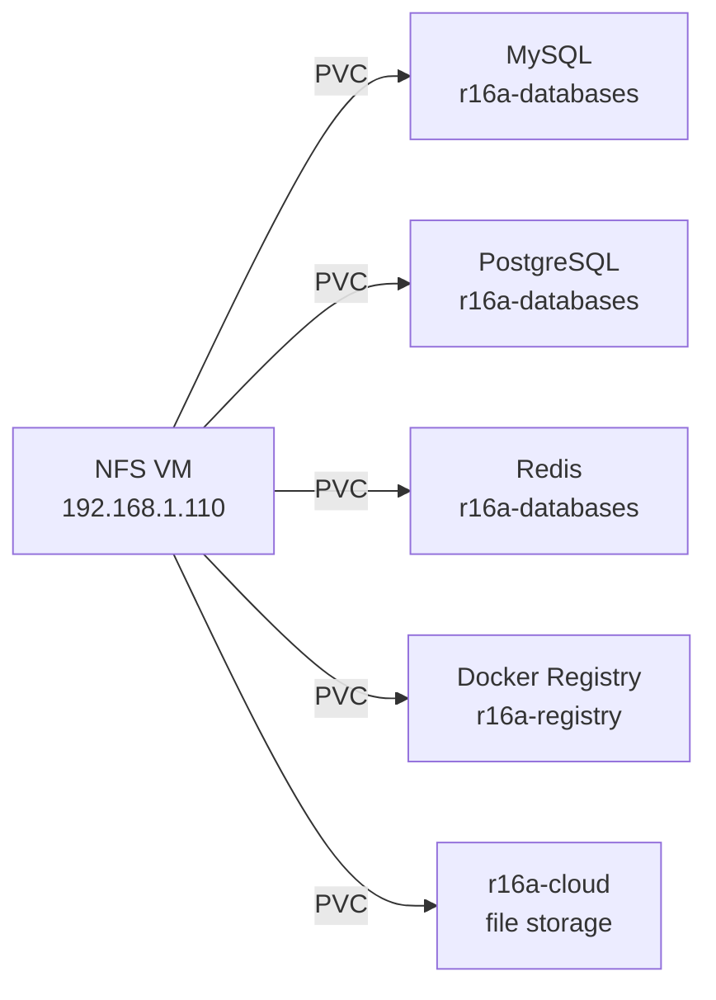

# Storage

> See also: [servers.md](./servers.md) | [kubernetes.md](./kubernetes.md)

---

## Overview

The NFS Server VM (`192.168.1.110`) is the **single persistent storage layer** for the entire homelab. Every stateful workload — whether a k8s pod or a VM-level app — stores its data here. This makes it the highest-priority asset for backups.

---

## NFS Server VM

| Property  | Value                     |
|-----------|---------------------------|
| IP        | `192.168.1.110`           |
| Type      | Proxmox VM                |
| Protocol  | NFS                       |
| Role      | Persistent storage for all k8s PVCs and direct app mounts |

---

## Consumer map

### PVC inventory

| Workload           | Namespace        | Mount purpose                    |
|--------------------|------------------|----------------------------------|
| MySQL              | `r16a-databases` | Database files                   |
| PostgreSQL         | `r16a-databases` | Database files                   |
| Redis              | `r16a-databases` | Persistence / AOF / RDB snapshot |
| Docker Registry    | `r16a-registry`  | Image layer storage              |
| r16a-cloud backend | `r16a-cloud`     | File storage                     |
